## Step #2 — Designing Data Warehouse Model

Tahap ini mendesain Data Warehouse menggunakan pendekatan **Dimensional Modeling (Kimball-style)**. Desain dibuat untuk:

* menjaga **akurasi metrik** (anti double counting),
* mendukung **drill-down** (seller/product/location/customer),
* serta memastikan data tetap akurat dan konsisten melalui **definition locks**, **penanganan late-arriving**, dan **auditability**.

**Sumber Data (OLTP):**
`orders`, `order_items`, `customers`, `sellers`, `products`, `product_category_name_translation`, `order_reviews`, `order_payments`, `geolocation`

> **NOTE!**
> Semua kolom tanggal pada source berformat `text` (DDL). Konversi (*casting*) ke `timestamp/date` dilakukan di staging sebelum dimuat ke DW.

---

# Design Dimensional Model Process

---

## 2.1 Select Business Process

Data Warehouse mendukung **4 proses bisnis inti** berikut:

### 1) Sales & Order Analysis

* **Tujuan:** GMV, jumlah item terjual, AOV, kontribusi seller, tren kategori/produk, performa wilayah.
* **Alasan:** 1 order bisa multi-item dan multi-seller; analitik harus sampai item-level agar GMV akurat dan drill-down tersedia.

### 2) Order Fulfillment & Delivery Performance

* **Tujuan:** lead time (purchase→approved→carrier→delivered), delay, late rate, bottleneck.
* **Alasan:** timestamp lifecycle berada di level order (`orders.*`), namun analisis operasional sering diminta sampai seller/product-level; dibutuhkan strategi agar hasil tetap valid.

### 3) Customer Satisfaction & Review Analytics

* **Tujuan:** rata-rata review score, proporsi negatif, analisis teks (opsional topic/sentiment).
* **Alasan:** review ada di level order (`order_reviews`), sementara analisis sering diminta per seller/kategori; diperlukan strategi agar tidak bias saat dikaitkan ke multi-item.

### 4) Payment Analysis & Reconciliation

* **Tujuan:** komposisi payment type, installments, total payment value, rekonsiliasi pembayaran vs penjualan.
* **Alasan:** 1 order bisa multi pembayaran (`order_payments.payment_sequential`), dan tabel payment tidak memiliki timestamp → tren waktu memakai proxy date.

---

### Definition Locks (standar baku)

* **GMV** = `SUM(order_items.price)` (freight terpisah).
* KPI finansial default **delivered-only** (via `dim_order_status.status_group='Delivered'`).
* Tren payment menggunakan **proxy date** = `orders.order_purchase_timestamp` (karena tidak ada timestamp pembayaran di `order_payments`).
* Late-arriving status/timestamp → pipeline menggunakan **backfill window 7–14 hari** untuk lifecycle dan tabel turunan.

---

## 2.2 Declare Grain

Grain = “1 baris di fact table merepresentasikan apa”. Grain yang benar mencegah *double counting* dan memastikan drill-down sesuai kebutuhan.

### A) Fact Tables (Core)

1. **`fact_sales_item`**

* **Grain:** 1 baris per **order item** (`order_id`, `order_item_id`)
* **Alasan:** `price` dan `freight_value` berada di item-level (`order_items`); 1 order dapat berisi banyak seller/produk.

2. **`fact_payments_txn`**

* **Grain:** 1 baris per **payment transaction** (`order_id`, `payment_sequential`)
* **Alasan:** 1 order dapat memiliki banyak transaksi pembayaran → wajib dipisah dari sales untuk menghindari multi-item × multi-payment duplication.

3. **`fact_order_lifecycle`** (Accumulating Snapshot)

* **Grain:** 1 baris per **order** (`order_id`)
* **Alasan:** milestone timestamp pengiriman berada di `orders` (header); baris akan terupdate seiring perubahan status/timestamp.

4. **`fact_reviews`**

* **Grain:** 1 baris per **review** (`review_id`)
* **Alasan:** review adalah event terpisah (score + text + timestamp) di `order_reviews`.

### B) Derived / Bridge (Enterprise Best Practice)

5. **`fact_order_item_fulfillment`** (Derived Fact @ item)

* **Grain:** 1 baris per **order item** (`order_id`, `order_item_id`)
* **Alasan:** membawa metrik delivery dari order-level (`orders`) ke item-level agar “late rate per seller/product” valid.

6. **`bridge_review_item_allocation`** (Allocation Bridge)

* **Grain:** 1 baris per **(review × order_item)**
* **Alasan:** menghindari bias/double counting saat review order-level dihubungkan ke banyak item/seller.

---

## 2.3 Identify The Dimension

Model menggunakan **Conformed Dimensions** (dipakai lintas fact) dan **Role-Playing Date**.

> **NOTE!**
> Semua dimensi memakai **Surrogate Key (SK)** dan menyediakan **Unknown Member** (`*_sk = 0`) untuk menangani missing keys / late-arriving.

### 1) `dim_date` (Role-Playing)

* **Source:** generated calendar
* **Business Key:** `full_date` (YYYY-MM-DD)
* **Surrogate Key:** `date_sk` (INT YYYYMMDD)
* **Attributes:** year, quarter, month, week_of_year, day, day_name, is_weekend (opsional: is_holiday)
* **Behavior:** role-playing untuk purchase_date, approved_date, carrier_date, delivered_date, estimated_date, review_date.

### 2) `dim_customer_person` (Customer Unik)

* **Source:** `customers`
* **Business Key:** `customers.customer_unique_id`
* **Surrogate Key:** `customer_person_sk`
* **Attributes:** customer_unique_id
* **Behavior:** analisis repeat customer / cohort / perilaku pelanggan unik.

### 3) `dim_customer_address` (Alamat Transaksi)

* **Source:** `customers`
* **Business Key:** `customers.customer_id`
* **Surrogate Key:** `customer_address_sk`
* **Attributes:** zip_code_prefix (`customer_zip_code_prefix`), city (`customer_city`), state (`customer_state`), `location_sk` (lookup)
* **Behavior:** konteks lokasi per transaksi.

### 4) `dim_location` (Geospatial Lookup)

* **Source:** agregasi `geolocation` per `geolocation_zip_code_prefix`
* **Business Key:** `zip_code_prefix`
* **Surrogate Key:** `location_sk`
* **Attributes:** avg_lat, avg_lng, city, state
* **Behavior:** stabil untuk map/heatmap (mengurangi noise multi-point).

### 5) `dim_seller`

* **Source:** `sellers`
* **Business Key:** `sellers.seller_id`
* **Surrogate Key:** `seller_sk`
* **Attributes:** zip_code_prefix (`seller_zip_code_prefix`), city (`seller_city`), state (`seller_state`), `location_sk` (lookup)
* **Behavior:** analisis performa seller dan wilayah seller.

### 6) `dim_product`

* **Source:** `products` + `product_category_name_translation`
* **Business Key:** `products.product_id`
* **Surrogate Key:** `product_sk`
* **Attributes:** category_name_pt (`product_category_name`), category_name_en (`product_category_name_english`), photos_qty, weight_g, length_cm, height_cm, width_cm
* **Behavior:** grouping kategori dan analisis atribut produk.

> **NOTE!**
> Di OLTP, `products.product_photos_qty` bertipe `real` (DDL). Pada staging dapat dilakukan casting ke integer jika ingin diperlakukan sebagai “jumlah foto”.

### 7) `dim_payment_type`

* **Source:** DISTINCT `order_payments.payment_type`
* **Business Key:** `payment_type`
* **Surrogate Key:** `payment_type_sk`
* **Attributes:** `payment_type_name` (opsional; default sama dengan `payment_type`)
* **Behavior:** filter utama payment.

### 8) `dim_order_status`

* **Source:** DISTINCT `orders.order_status`
* **Business Key:** `order_status`
* **Surrogate Key:** `order_status_sk`
* **Attributes:** `status_group` (Delivered / Canceled / In Progress) **(derived mapping)**
* **Behavior:** governance KPI delivered-only dan penyederhanaan filter.

### 9) `dim_review_topic` (Opsional)

* **Source:** hasil NLP pipeline (mart/feature store), **bukan OLTP**
* **Business Key:** (topic_name + model_version)
* **Surrogate Key:** `review_topic_sk`
* **Attributes:** topic_name, model_version
* **Behavior:** reproducibility analisis teks (topic/sentiment).

---

## 2.4 Identify the Fact (Using More Than One Type of Fact Table)

Model memakai kombinasi **Transaction Facts + Accumulating Snapshot + Derived Fact + Allocation Bridge**.

### 1) `fact_sales_item` (Transaction Fact)

* **Grain:** 1 baris per order item (`order_id`, `order_item_id`)
* **Dimensions (FK):** `purchase_date_sk`, `customer_person_sk`, `customer_address_sk`, `seller_sk`, `product_sk`, `order_status_sk`
* **Degenerate Dim:** `order_id`
* **Measures:**
  `item_price` (= `order_items.price`) **(GMV component)**,
  `freight_value` (= `order_items.freight_value`),
  `item_qty = 1`,
  (opsional) `total_transaction_value = item_price + freight_value`

### 2) `fact_payments_txn` (Transaction Fact)

* **Grain:** 1 baris per payment transaction (`order_id`, `payment_sequential`)
* **Dimensions (FK):** `purchase_date_sk` (proxy), `customer_person_sk`, `customer_address_sk`, `payment_type_sk`, `order_status_sk`
* **Degenerate Dim:** `order_id`
* **Measures:** `payment_value` (= `order_payments.payment_value`), `installments` (= `order_payments.payment_installments`)

### 3) `fact_order_lifecycle` (Accumulating Snapshot Fact)

* **Grain:** 1 baris per order (`order_id`)
* **Dimensions (FK):** `customer_person_sk`, `customer_address_sk`, `order_status_sk`
* **Role-Playing Dates (FK ke dim_date):** `purchase_date_sk`, `approved_date_sk`, `carrier_date_sk`, `delivered_date_sk`, `estimated_date_sk`
* **Source timestamp (OLTP → staging cast):**
  `orders.order_purchase_timestamp`, `orders.order_approved_at`,
  `orders.order_delivered_carrier_date`, `orders.order_delivered_customer_date`,
  `orders.order_estimated_delivery_date`
* **Measures (derived):** `days_to_approve`, `days_to_carrier`, `days_to_deliver`, `delay_days`, `is_late`
* **Load behavior:** MERGE/UPSERT + backfill window 7–14 hari

### 4) `fact_order_item_fulfillment` (Derived Fact @ Item)

* **Grain:** 1 baris per order item (`order_id`, `order_item_id`)
* **Purpose:** seller/product-level delay metrics yang valid
* **Dimensions (FK):** `purchase_date_sk`, `delivered_date_sk`, `estimated_date_sk`, `customer_person_sk`, `customer_address_sk`, `seller_sk`, `product_sk`, `order_status_sk`
* **Measures (derived dari orders + melekat ke item):** `days_to_deliver`, `delay_days`, `is_late`

### 5) `fact_reviews` (Transaction Fact)

* **Grain:** 1 baris per review (`review_id`)
* **Dimensions (FK):** `review_date_sk`, `customer_person_sk`, `customer_address_sk`, (opsional, nullable) `review_topic_sk`
* **Degenerate Dim:** `review_id`, `order_id`
* **Measures/Attributes:**
  `review_score` (= `order_reviews.review_score`),
  `is_negative_flag` (derived, mis. score<=2),
  `review_title` (= `order_reviews.review_comment_title`),
  `review_message` (= `order_reviews.review_comment_message`)

### 6) `bridge_review_item_allocation` (Allocation Bridge)

* **Grain:** 1 baris per (review × order_item)
* **Keys (FK):** `review_fact_sk`, `seller_sk`, `product_sk` (+ `order_id`, `order_item_id` untuk traceability)
* **Measure (derived):** `allocation_factor`
* **Default rule (best practice):** price-weighted
  `allocation_factor = item_price / SUM(item_price) per order`
  fallback: equal split jika denominator 0/NULL.

---

## 2.5 Full ERD

```mermaid
erDiagram

  %% ----------------------------
  %% DIMENSIONS
  %% ----------------------------
  dim_date {
    int date_sk PK
    date full_date UK
    int year
    int quarter
    int month
    int week_of_year
    int day
    string day_name
    bool is_weekend
  }

  dim_customer_person {
    int customer_person_sk PK
    string customer_unique_id UK
  }

  dim_location {
    int location_sk PK
    int zip_code_prefix UK
    float avg_lat
    float avg_lng
    string city
    string state
  }

  dim_customer_address {
    int customer_address_sk PK
    string customer_id UK
    int zip_code_prefix
    string city
    string state
    int location_sk FK
  }

  dim_seller {
    int seller_sk PK
    string seller_id UK
    int zip_code_prefix
    string city
    string state
    int location_sk FK
  }

  dim_product {
    int product_sk PK
    string product_id UK
    string category_name_pt
    string category_name_en
    float photos_qty
    float weight_g
    float length_cm
    float height_cm
    float width_cm
  }

  dim_payment_type {
    int payment_type_sk PK
    string payment_type UK
    string payment_type_name
  }

  dim_order_status {
    int order_status_sk PK
    string order_status UK
    string status_group
  }

  dim_review_topic {
    int review_topic_sk PK
    string topic_name
    string model_version
  }

  %% ----------------------------
  %% FACTS
  %% ----------------------------
  fact_sales_item {
    bigint sales_item_sk PK
    string order_id "DD"
    int order_item_id
    int purchase_date_sk FK
    int customer_person_sk FK
    int customer_address_sk FK
    int seller_sk FK
    int product_sk FK
    int order_status_sk FK
    float item_price
    float freight_value
    float total_transaction_value
    int item_qty
  }

  fact_payments_txn {
    bigint payment_txn_sk PK
    string order_id "DD"
    int payment_sequential
    int purchase_date_sk FK
    int customer_person_sk FK
    int customer_address_sk FK
    int payment_type_sk FK
    int order_status_sk FK
    float payment_value
    int installments
  }

  fact_order_lifecycle {
    bigint order_lifecycle_sk PK
    string order_id "DD"
    int customer_person_sk FK
    int customer_address_sk FK
    int order_status_sk FK
    int purchase_date_sk FK
    int approved_date_sk FK
    int carrier_date_sk FK
    int delivered_date_sk FK
    int estimated_date_sk FK
    int days_to_approve
    int days_to_carrier
    int days_to_deliver
    int delay_days
    bool is_late
  }

  fact_order_item_fulfillment {
    bigint item_fulfillment_sk PK
    string order_id "DD"
    int order_item_id
    int customer_person_sk FK
    int customer_address_sk FK
    int seller_sk FK
    int product_sk FK
    int order_status_sk FK
    int purchase_date_sk FK
    int delivered_date_sk FK
    int estimated_date_sk FK
    int days_to_deliver
    int delay_days
    bool is_late
  }

  fact_reviews {
    bigint review_fact_sk PK
    string review_id "DD"
    string order_id "DD"
    int review_date_sk FK
    int customer_person_sk FK
    int customer_address_sk FK
    int review_topic_sk FK
    int review_score
    bool is_negative_flag
    string review_title
    string review_message
  }

  bridge_review_item_allocation {
    bigint bridge_sk PK
    bigint review_fact_sk FK
    string review_id "DD"
    string order_id "DD"
    int order_item_id
    int seller_sk FK
    int product_sk FK
    float allocation_factor
  }

  %% ----------------------------
  %% RELATIONSHIPS
  %% ----------------------------
  dim_location ||--o{ dim_customer_address : location_sk
  dim_location ||--o{ dim_seller : location_sk

  dim_date ||--o{ fact_sales_item : purchase_date_sk
  dim_date ||--o{ fact_payments_txn : purchase_date_sk
  dim_date ||--o{ fact_order_lifecycle : purchase_date_sk
  dim_date ||--o{ fact_order_lifecycle : approved_date_sk
  dim_date ||--o{ fact_order_lifecycle : carrier_date_sk
  dim_date ||--o{ fact_order_lifecycle : delivered_date_sk
  dim_date ||--o{ fact_order_lifecycle : estimated_date_sk
  dim_date ||--o{ fact_order_item_fulfillment : purchase_date_sk
  dim_date ||--o{ fact_order_item_fulfillment : delivered_date_sk
  dim_date ||--o{ fact_order_item_fulfillment : estimated_date_sk
  dim_date ||--o{ fact_reviews : review_date_sk

  dim_customer_person ||--o{ fact_sales_item : customer_person_sk
  dim_customer_person ||--o{ fact_payments_txn : customer_person_sk
  dim_customer_person ||--o{ fact_order_lifecycle : customer_person_sk
  dim_customer_person ||--o{ fact_order_item_fulfillment : customer_person_sk
  dim_customer_person ||--o{ fact_reviews : customer_person_sk

  dim_customer_address ||--o{ fact_sales_item : customer_address_sk
  dim_customer_address ||--o{ fact_payments_txn : customer_address_sk
  dim_customer_address ||--o{ fact_order_lifecycle : customer_address_sk
  dim_customer_address ||--o{ fact_order_item_fulfillment : customer_address_sk
  dim_customer_address ||--o{ fact_reviews : customer_address_sk

  dim_order_status ||--o{ fact_sales_item : order_status_sk
  dim_order_status ||--o{ fact_payments_txn : order_status_sk
  dim_order_status ||--o{ fact_order_lifecycle : order_status_sk
  dim_order_status ||--o{ fact_order_item_fulfillment : order_status_sk

  dim_seller ||--o{ fact_sales_item : seller_sk
  dim_product ||--o{ fact_sales_item : product_sk
  dim_payment_type ||--o{ fact_payments_txn : payment_type_sk

  dim_seller ||--o{ fact_order_item_fulfillment : seller_sk
  dim_product ||--o{ fact_order_item_fulfillment : product_sk

  dim_review_topic ||--o{ fact_reviews : review_topic_sk

  fact_reviews ||--o{ bridge_review_item_allocation : review_fact_sk
  dim_seller ||--o{ bridge_review_item_allocation : seller_sk
  dim_product ||--o{ bridge_review_item_allocation : product_sk

```

> **NOTE!**
> Kolom `fact_reviews.review_topic_sk` bersifat nullable karena `dim_review_topic`
> berasal dari pipeline NLP yang opsional dan tidak selalu menghasilkan topik
> untuk setiap review.

## 2.6 Bus Matrix

> ✅ = dimensi digunakan oleh fact/bridge

| Fact / Bridge                                         | dim_date (role-playing)                         | dim_customer_person | dim_customer_address | dim_location (via address/seller) | dim_seller | dim_product | dim_order_status | dim_payment_type |       dim_review_topic |
| ----------------------------------------------------- | ----------------------------------------------- | ------------------: | -------------------: | --------------------------------: | ---------: | ----------: | ---------------: | ---------------: | ---------------------: |
| **fact_sales_item** (Transaction)                     | ✅ purchase                                      |                   ✅ |                    ✅ |                                 ✅ |          ✅ |           ✅ |                ✅ |                  |                        |
| **fact_payments_txn** (Transaction)                   | ✅ purchase (proxy)                              |                   ✅ |                    ✅ |                                 ✅ |            |             |                ✅ |                ✅ |                        |
| **fact_order_lifecycle** (Accumulating Snapshot)      | ✅ purchase/approved/carrier/delivered/estimated |                   ✅ |                    ✅ |                                 ✅ |            |             |                ✅ |                  |                        |
| **fact_order_item_fulfillment** (Derived @ item)      | ✅ purchase/delivered/estimated                  |                   ✅ |                    ✅ |                                 ✅ |          ✅ |           ✅ |                ✅ |                  |                        |
| **fact_reviews** (Transaction)                        | ✅ review                                        |                   ✅ |                    ✅ |                                 ✅ |            |             |                  |                  |           ✅ (nullable) |
| **bridge_review_item_allocation** (Allocation Bridge) | (n/a)                                           |               (n/a) |                (n/a) |                             (n/a) |          ✅ |           ✅ |                  |                  |                        |
| ↳ Link Bridge → Reviews                               |                                                 |                     |                      |                                   |            |             |                  |                  | **FK: review_fact_sk** |

**Catatan**

* `dim_order_status.status_group` digunakan sebagai governance filter delivered-only KPI.
* `fact_order_item_fulfillment` memungkinkan analisis keterlambatan per seller/product secara valid.
* `bridge_review_item_allocation` mencegah bias/double counting saat menghitung review score per seller/product.

---

## Glossary — Data Warehouse & Dimensional Modeling

| Istilah                              | Penjelasan singkat                                                                                        |
|--------------------------------------| --------------------------------------------------------------------------------------------------------- |
| **Stakeholder**                      | Pihak pengguna data yang menentukan kebutuhan laporan dan KPI (Finance, Ops, CX, BI).                     |
| **Requirements Gathering**           | Tahap mengumpulkan kebutuhan: laporan apa, definisi metrik, filter, dan level detail.                     |
| **OLTP**                             | Database operasional transaksi (tabel sumber seperti `orders`, `order_items`, dll).                       |
| **Data Warehouse (DW)**              | Sistem penyimpanan terstruktur untuk analitik: konsisten, siap agregasi, mudah diaudit.                   |
| **Dimensional Modeling (Kimball-style)** | Metode desain DW: memisahkan **Fact** (angka) dan **Dimension** (konteks).                                |
| **Star Schema**                      | Pola relasi fact di tengah dengan banyak dimension di sekelilingnya.                                      |
| **Fact Constellation (Multi-fact)**  | Desain dengan beberapa fact table yang berbagi dimensi (sales, payments, lifecycle, reviews).             |
| **Business Process**                 | Domain analitik: **Sales**, **Delivery**, **Reviews**, **Payments**.                                      |
| **Definition Locks**                 | Kesepakatan baku definisi metrik & filter (GMV, delivered-only, proxy payment date).                      |
| **KPI**                              | Metrik performa bisnis (GMV, AOV, late rate, avg review score, dll).                                      |
| **GMV (Gross Merchandise Value)**    | Total nilai barang terjual; pada desain: `SUM(order_items.price)` (tanpa freight).                        |
| **Freight / Freight Value**          | Ongkos kirim (`order_items.freight_value`), ditampilkan terpisah dari GMV.                                |
| **AOV (Average Order Value)**        | Rata-rata nilai order (umumnya dihitung pada order yang delivered).                                       |
| **Grain (Granularity)**              | Definisi “1 baris fact mewakili apa” (order item / order / payment transaction / review).                 |
| **Fact Table**                       | Tabel berisi angka/measures pada grain tertentu, memakai FK ke dimensi.                                   |
| **Dimension Table**                  | Tabel konteks untuk filter/grouping (date, product, seller, customer, status, location).                  |
| **Measure**                          | Nilai numerik untuk agregasi (SUM/AVG/COUNT), mis. `item_price`, `payment_value`, `delay_days`.           |
| **Attribute**                        | Kolom deskriptif pada dimensi (city/state/kategori) untuk segmentasi dan filter.                          |
| **Business Key (BK)**                | Kunci alami dari OLTP (mis. `product_id`, `seller_id`, `customer_id`).                                    |
| **Surrogate Key (SK)**               | Kunci buatan di DW (biasanya integer) untuk join cepat dan konsisten.                                     |
| **Foreign Key (FK)**                 | Kolom di fact yang menunjuk ke dimensi (mis. `product_sk`, `customer_address_sk`).                        |
| **Degenerate Dimension (DD)**        | ID yang disimpan langsung di fact tanpa dimensi terpisah (mis. `order_id`, `review_id`).                  |
| **Conformed Dimension**              | Dimensi yang dipakai bersama oleh banyak fact dengan definisi yang sama.                                  |
| **Role-Playing Dimension**           | Satu dimensi dipakai untuk beberapa peran; contoh `dim_date` untuk purchase/delivered/review.             |
| **Transaction Fact**                 | Fact kejadian detail (mis. 1 baris per `order_item`, 1 baris per `payment_sequential`).                   |
| **Accumulating Snapshot Fact**       | Fact 1 baris per proses (order lifecycle) yang kolomnya bisa ter-update saat status berubah.              |
| **Periodic Snapshot Fact**           | Ringkasan periodik (harian/mingguan/bulanan); disebut sebagai konsep, tidak wajib di desain inti.         |
| **Derived Fact**                     | Fact turunan untuk mengubah grain; contoh: order-level delivery ditempel ke item-level.                   |
| **Bridge Table**                     | Tabel penghubung untuk relasi kompleks/alokasi; contoh: review (order-level) ke item/seller.              |
| **Allocation Factor**                | Bobot pembagian nilai (mis. review) saat 1 event terkait banyak item.                                     |
| **Price-weighted Allocation**        | Alokasi berbobot harga: `item_price / SUM(item_price)` per order.                                         |
| **Equal Split**                      | Alokasi rata: `1 / jumlah_item` per order (fallback jika pembobotan tidak valid).                         |
| **One-to-Many**                      | Relasi 1 baris ke banyak baris (order → items, order → payments).                                         |
| **Double Counting**                  | Angka terhitung ganda akibat join one-to-many tanpa kontrol grain.                                        |
| **Bias (Analitik)**                  | Hasil analisis menjadi tidak adil/salah (contoh: review order-level dihitung berulang untuk banyak item). |
| **Payment Transaction**              | Satu record pembayaran pada `order_payments` ditandai `payment_sequential`.                               |
| **Multi-payment per Order**          | Satu order bisa punya banyak pembayaran; alasan pemisahan `fact_payments_txn` dari sales.                 |
| **Proxy Date**                       | Tanggal pengganti saat timestamp asli tidak tersedia; payment trend memakai `order_purchase_timestamp`.   |
| **Lead Time**                        | Durasi antar milestone proses pengiriman (purchase→approved→carrier→delivered).                           |
| **Delay / Delay Days**               | Selisih antara delivered dan estimated delivery date (`delay_days`).                                      |
| **Late Rate / Is Late**              | Indikator keterlambatan (`is_late`) jika delivered melewati estimated date.                               |
| **Late-Arriving Data**               | Data penting datang belakangan (mis. delivered date/status terisi setelah beberapa hari).                 |
| **Backfill Window**                  | Rentang muat ulang historis (7–14 hari) untuk menangkap update late-arriving.                             |
| **MERGE/UPSERT**                     | Pola load yang mendukung insert+update berdasarkan key (utama untuk accumulating snapshot).               |
| **Casting**                          | Mengubah tipe data; pada dataset ini tanggal OLTP `text` → `timestamp/date` di staging.                   |
| **Staging Layer**                    | Lapisan sebelum DW untuk casting, cleaning, standardisasi kolom OLTP.                                     |
| **Auditability / Traceability**      | Kemampuan menelusuri angka ke sumber (dibantu DD seperti `order_id`).                                     |
| **Reconciliation**                   | Pengecekan selisih metrik lintas domain (GMV delivered vs total payments delivered).                      |
| **Data Quality Checks**              | Validasi seperti missing keys, nilai aneh, dan rekonsiliasi untuk monitoring kualitas.                    |
| **Unknown Member (SK=0)**            | Baris default di dimensi untuk menjaga FK valid saat key belum tersedia/NULL.                             |
| **Customer Unique vs Address**       | `customer_unique_id` untuk identitas unik (repeat behavior), `customer_id` untuk alamat transaksi.        |
| **Geospatial Aggregation**           | Agregasi `geolocation` per zip prefix (avg lat/lng) agar stabil untuk peta/heatmap.                       |
| **Category Translation (PT→EN)**     | Join `products.product_category_name` ke `product_category_name_translation` untuk kategori Inggris.      |
| **NLP Topic Dimension**              | `dim_review_topic`: hasil pipeline NLP (bukan OLTP), boleh nullable di `fact_reviews`.                    |

---

### Mentoring - Exercise 1 - Data Storage
Dokumen ini dibuat sebagai bagian dari pembelajaran di <strong>Pacmann Academy Bootcamp</strong>.

<a href="https://pacmann.io">pacmann.io</a>

