## Step #3 — Create Report

# Data Warehouse for Olist with Kimball Dimensional Modeling

## Introduction

Olist adalah ekosistem e-commerce dengan kebutuhan analitik lintas fungsi. Tim Finance membutuhkan metrik pendapatan yang konsisten, tim Operations perlu memantau kinerja pengiriman, tim Customer Experience membutuhkan indikator kepuasan pelanggan, dan tim Growth/BI memerlukan pandangan terpadu untuk pengambilan keputusan.

Data operasional (OLTP) Olist tersimpan di tabel seperti `orders`, `order_items`, `order_payments`, dan `order_reviews`, serta tabel pendukung seperti `customers`, `sellers`, `products`, `product_category_name_translation`, dan `geolocation`. Struktur OLTP cocok untuk transaksi, namun kurang ideal untuk analitik karena:

* Satu order dapat berisi banyak item dan banyak seller (multi-item, multi-seller).
* Satu order dapat memiliki banyak transaksi pembayaran (`payment_sequential`) (multi-payment).
* Review berada di level order, bukan level item/seller.
* Timestamp lifecycle pengiriman dapat terisi belakangan (*late-arriving*).

Tanpa pemodelan yang tepat, analitik rentan terhadap **double counting**, bias pengukuran, serta perbedaan definisi KPI antar laporan. Karena itu, Data Warehouse dirancang dengan pendekatan **Kimball Dimensional Modeling** (star schema + fact constellation) agar query analitik lebih sederhana, konsisten, dan aman.

> **NOTE!**
> Pada source OLTP, kolom tanggal/timestamp tersimpan sebagai `text` (DDL). Konversi (*casting*) ke `timestamp/date` dilakukan di staging sebelum dimuat ke Data Warehouse.

---

## Requirements Gathering Process

Requirements gathering difokuskan pada tiga hal: **apa yang ingin diukur**, **definisi metrik**, dan **level detail yang dibutuhkan**. Hasil utamanya:

### 1) Proses bisnis inti yang harus didukung

Empat domain analitik utama:

1. Sales & Order Analysis
2. Order Fulfillment & Delivery Performance
3. Customer Satisfaction & Review Analytics
4. Payment Analysis & Reconciliation

### 2) Definition Locks (standarisasi KPI)

Agar semua laporan konsisten:

* **GMV = SUM(order_items.price)**, freight/ongkir dipisahkan (`freight_value`).
* KPI finansial default menghitung order **delivered-only** melalui governance `dim_order_status.status_group`.
* `order_payments` tidak memiliki timestamp pembayaran → tren pembayaran memakai **purchase timestamp** `orders.order_purchase_timestamp` sebagai **proxy date**.
* Lifecycle dapat late-arriving → pipeline memerlukan **backfill window 7–14 hari** (khususnya untuk accumulating snapshot dan tabel turunan).

### 3) Kebutuhan drill-down dan risiko data

* Sales wajib item-level untuk analisis seller/product/kategori/wilayah.
* Delivery timestamp ada di order-level (`orders.*`) tetapi analisis diminta sampai seller/product-level.
* Review ada di order-level (`order_reviews`) tetapi analisis diminta per seller/kategori tanpa bias.

---

## Designing the Data Warehouse Model

### Selected Business Processes and Their Relevance

Keempat proses bisnis dipilih karena langsung mendukung KPI dan keputusan bisnis:

**1. Sales & Order Analysis**
Menghasilkan GMV, AOV, kontribusi seller, tren kategori/produk, dan analisis wilayah.

**2. Fulfillment & Delivery Performance**
Mengukur lead time antar milestone (purchase → approved → carrier → delivered), delay, late rate, dan bottleneck.

**3. Customer Satisfaction & Review Analytics**
Mengukur rata-rata review score, persentase ulasan negatif, dan (opsional) analisis teks.

**4. Payment Analysis & Reconciliation**
Mengukur payment type mix, installments, total payment value, serta kontrol rekonsiliasi terhadap penjualan.

---

### Grain Declaration (and Why It Matters)

Grain adalah definisi “satu baris di tabel fakta merepresentasikan apa”. Grain yang benar mencegah double counting dan memastikan drill-down berjalan sesuai kebutuhan.

**Core facts (grain utama):**

* **Sales grain:** 1 baris per **order item** (`order_id`, `order_item_id`)
  Alasan: `price` dan `freight_value` berada di item-level, dan satu order bisa multi-seller.

* **Payments grain:** 1 baris per **payment transaction** (`order_id`, `payment_sequential`)
  Alasan: satu order bisa memiliki beberapa pembayaran; pemisahan mencegah ledakan baris (multi-item × multi-payment).

* **Order lifecycle grain:** 1 baris per **order** (`order_id`)
  Alasan: milestone timestamp pengiriman berada di `orders` (order-level).

* **Reviews grain:** 1 baris per **review** (`review_id`)
  Alasan: review adalah event tersendiri (score, text, tanggal review).

**Enterprise enablers (untuk perbedaan level detail):**

* **Derived fulfillment @ item:** 1 baris per order item
  Tujuan: membawa metrik delivery dari order-level ke item-level agar analisis keterlambatan per seller/product valid.

* **Allocation bridge untuk review:** 1 baris per (review × order_item)
  Tujuan: menghubungkan review order-level ke item/seller/product tanpa menggandakan review, menggunakan faktor alokasi.

---

### Dimensions (Conformed and Role-Playing)

Dimensi adalah konteks untuk filter, grouping, dan drill-down. Model menggunakan **conformed dimensions** agar konsisten lintas fakta, serta **role-playing date** agar satu dimensi tanggal dapat dipakai untuk banyak konteks.

**Dimensi utama:**

* **`dim_date` (role-playing):** dipakai sebagai purchase_date, approved_date, delivered_date, estimated_date, review_date, dll.
* **Customer split (best practice):**

  * `dim_customer_person` (BK: `customer_unique_id`) untuk analisis pelanggan unik/repeat.
  * `dim_customer_address` (BK: `customer_id`) untuk konteks alamat transaksi (zip/city/state).
* **`dim_location`:** agregasi `geolocation` by zip_prefix (avg lat/lng) untuk peta/heatmap.
* **`dim_seller` dan `dim_product`:** drill-down performa seller, kategori, dan atribut produk (termasuk translasi kategori PT→EN dari `product_category_name_translation`).
* **`dim_payment_type`:** lookup metode pembayaran.
* **`dim_order_status`:** status asli + `status_group` untuk governance delivered-only KPI.
* **`dim_review_topic` (opsional):** topic NLP + versi model untuk reproducibility.

**Praktik DW yang diterapkan:**

* Semua dimensi menggunakan **surrogate key**.
* Disediakan **Unknown Member (SK=0)** untuk menjaga integritas relasi saat data belum lengkap atau datang terlambat.

---

### Fact Tables Used and Their Types

#### Transaction Facts

**1) `fact_sales_item` (Transaction Fact)**

* Grain: order item
* Measures: `item_price` (komponen GMV), `freight_value`, `total_transaction_value` (opsional)
* FK: purchase_date, customer_person, customer_address, seller, product, order_status

**2) `fact_payments_txn` (Transaction Fact)**

* Grain: payment transaction
* Measures: `payment_value`, `installments`
* FK: purchase_date (proxy), customer_person, customer_address, payment_type, order_status

**3) `fact_reviews` (Transaction Fact)**

* Grain: review
* Measures/attributes: `review_score`, `is_negative_flag` (derived), title/message
* FK: review_date, customer_person, customer_address, review_topic (opsional)

#### Accumulating Snapshot Fact

**4) `fact_order_lifecycle` (Accumulating Snapshot Fact)**

* Grain: order
* Measures: `days_to_approve`, `days_to_carrier`, `days_to_deliver`, `delay_days`, `is_late` (derived dari timestamp `orders.*`)
* Role-playing dates: purchase/approved/carrier/delivered/estimated
* Load behavior: **MERGE/UPSERT** + **backfill 7–14 hari** untuk menangani late-arriving

#### Derived Fact

**5) `fact_order_item_fulfillment` (Derived Fact @ item)**
Melekatkan metrik lifecycle (order-level) ke item-level agar keterlambatan dapat dianalisis per seller/product secara valid.

#### Allocation Bridge

**6) `bridge_review_item_allocation` (Allocation Bridge)**
Menghubungkan review ke item/seller/product menggunakan `allocation_factor`.
Default rule: **price-weighted** (`item_price / SUM(item_price) per order`) dengan fallback equal split.

---

## Final ERD

```mermaid
erDiagram
  dim_location ||--o{ dim_customer_address : location_sk
  dim_location ||--o{ dim_seller : location_sk

  dim_date ||--o{ fact_sales_item : purchase_date_sk
  dim_date ||--o{ fact_payments_txn : purchase_date_sk
  dim_date ||--o{ fact_order_lifecycle : purchase_date_sk
  dim_date ||--o{ fact_order_lifecycle : approved_date_sk
  dim_date ||--o{ fact_order_lifecycle : carrier_date_sk
  dim_date ||--o{ fact_order_lifecycle : delivered_date_sk
  dim_date ||--o{ fact_order_lifecycle : estimated_date_sk
  dim_date ||--o{ fact_order_item_fulfillment : purchase_date_sk
  dim_date ||--o{ fact_order_item_fulfillment : delivered_date_sk
  dim_date ||--o{ fact_order_item_fulfillment : estimated_date_sk
  dim_date ||--o{ fact_reviews : review_date_sk

  dim_customer_person ||--o{ fact_sales_item : customer_person_sk
  dim_customer_person ||--o{ fact_payments_txn : customer_person_sk
  dim_customer_person ||--o{ fact_order_lifecycle : customer_person_sk
  dim_customer_person ||--o{ fact_order_item_fulfillment : customer_person_sk
  dim_customer_person ||--o{ fact_reviews : customer_person_sk

  dim_customer_address ||--o{ fact_sales_item : customer_address_sk
  dim_customer_address ||--o{ fact_payments_txn : customer_address_sk
  dim_customer_address ||--o{ fact_order_lifecycle : customer_address_sk
  dim_customer_address ||--o{ fact_order_item_fulfillment : customer_address_sk
  dim_customer_address ||--o{ fact_reviews : customer_address_sk

  dim_order_status ||--o{ fact_sales_item : order_status_sk
  dim_order_status ||--o{ fact_payments_txn : order_status_sk
  dim_order_status ||--o{ fact_order_lifecycle : order_status_sk
  dim_order_status ||--o{ fact_order_item_fulfillment : order_status_sk

  dim_seller ||--o{ fact_sales_item : seller_sk
  dim_product ||--o{ fact_sales_item : product_sk
  dim_payment_type ||--o{ fact_payments_txn : payment_type_sk

  dim_seller ||--o{ fact_order_item_fulfillment : seller_sk
  dim_product ||--o{ fact_order_item_fulfillment : product_sk

  dim_review_topic ||--o{ fact_reviews : review_topic_sk

  fact_reviews ||--o{ bridge_review_item_allocation : review_fact_sk
  dim_seller ||--o{ bridge_review_item_allocation : seller_sk
  dim_product ||--o{ bridge_review_item_allocation : product_sk
```

---

## Bus Matrix

| Fact / Bridge                 | dim_date                       | dim_customer_person | dim_customer_address | dim_location | dim_seller | dim_product | dim_order_status | dim_payment_type | dim_review_topic |
| ----------------------------- | ------------------------------ | ------------------: | -------------------: | -----------: | ---------: | ----------: | ---------------: | ---------------: | ---------------: |
| fact_sales_item               | ✅ purchase                     |                   ✅ |                    ✅ |            ✅ |          ✅ |           ✅ |                ✅ |                  |                  |
| fact_payments_txn             | ✅ purchase(proxy)              |                   ✅ |                    ✅ |            ✅ |            |             |                ✅ |                ✅ |                  |
| fact_order_lifecycle          | ✅ role-playing                 |                   ✅ |                    ✅ |            ✅ |            |             |                ✅ |                  |                  |
| fact_order_item_fulfillment   | ✅ purchase/delivered/estimated |                   ✅ |                    ✅ |            ✅ |          ✅ |           ✅ |                ✅ |                  |                  |
| fact_reviews                  | ✅ review                       |                   ✅ |                    ✅ |            ✅ |            |             |                  |                  |     ✅ (nullable) |
| bridge_review_item_allocation | (n/a)                          |               (n/a) |                (n/a) |        (n/a) |          ✅ |           ✅ |                  |                  |                  |

---

## Conclusion

Desain Data Warehouse Olist berbasis Kimball Dimensional Modeling menghasilkan model yang:

* **Akurat** melalui grain yang tepat dan pemisahan fakta untuk mencegah double counting (termasuk skenario multi-item × multi-payment).
* **Fleksibel** untuk drill-down seller/product/location/customer (termasuk translasi kategori PT→EN).
* **Tidak bias** untuk review-by-seller lewat allocation bridge dan faktor alokasi yang konsisten.
* **Siap operasional** menghadapi late-arriving lifecycle lewat accumulating snapshot + backfill.
* **Konsisten** melalui definition locks (GMV price-only, delivered-only governance, proxy payment date).

Output akhir berupa fact constellation, ERD, dan bus matrix menyediakan fondasi kuat untuk data mart, dashboard, rekonsiliasi metrik, dan analitik lanjutan.

---

---

## Glossary — Data Warehouse & Dimensional Modeling

| Istilah                                  | Penjelasan singkat                                                                                        |
|------------------------------------------| --------------------------------------------------------------------------------------------------------- |
| **Stakeholder**                          | Pihak pengguna data yang menentukan kebutuhan laporan dan KPI (Finance, Ops, CX, BI).                     |
| **Requirements Gathering**               | Tahap mengumpulkan kebutuhan: laporan apa, definisi metrik, filter, dan level detail.                     |
| **OLTP**                                 | Database operasional transaksi (tabel sumber seperti `orders`, `order_items`, dll).                       |
| **Data Warehouse (DW)**                  | Sistem penyimpanan terstruktur untuk analitik: konsisten, siap agregasi, mudah diaudit.                   |
| **Dimensional Modeling (Kimball-style)** | Metode desain DW: memisahkan **Fact** (angka) dan **Dimension** (konteks).                                |
| **Star Schema**                          | Pola relasi fact di tengah dengan banyak dimension di sekelilingnya.                                      |
| **Fact Constellation (Multi-fact)**      | Desain dengan beberapa fact table yang berbagi dimensi (sales, payments, lifecycle, reviews).             |
| **Business Process**                     | Domain analitik: **Sales**, **Delivery**, **Reviews**, **Payments**.                                      |
| **Definition Locks**                     | Kesepakatan baku definisi metrik & filter (GMV, delivered-only, proxy payment date).                      |
| **KPI**                                  | Metrik performa bisnis (GMV, AOV, late rate, avg review score, dll).                                      |
| **GMV (Gross Merchandise Value)**        | Total nilai barang terjual; pada desain: `SUM(order_items.price)` (tanpa freight).                        |
| **Freight / Freight Value**              | Ongkos kirim (`order_items.freight_value`), ditampilkan terpisah dari GMV.                                |
| **AOV (Average Order Value)**            | Rata-rata nilai order (umumnya dihitung pada order yang delivered).                                       |
| **Grain (Granularity)**                  | Definisi “1 baris fact mewakili apa” (order item / order / payment transaction / review).                 |
| **Fact Table**                           | Tabel berisi angka/measures pada grain tertentu, memakai FK ke dimensi.                                   |
| **Dimension Table**                      | Tabel konteks untuk filter/grouping (date, product, seller, customer, status, location).                  |
| **Measure**                              | Nilai numerik untuk agregasi (SUM/AVG/COUNT), mis. `item_price`, `payment_value`, `delay_days`.           |
| **Attribute**                            | Kolom deskriptif pada dimensi (city/state/kategori) untuk segmentasi dan filter.                          |
| **Business Key (BK)**                    | Kunci alami dari OLTP (mis. `product_id`, `seller_id`, `customer_id`).                                    |
| **Surrogate Key (SK)**                   | Kunci buatan di DW (biasanya integer) untuk join cepat dan konsisten.                                     |
| **Foreign Key (FK)**                     | Kolom di fact yang menunjuk ke dimensi (mis. `product_sk`, `customer_address_sk`).                        |
| **Degenerate Dimension (DD)**            | ID yang disimpan langsung di fact tanpa dimensi terpisah (mis. `order_id`, `review_id`).                  |
| **Conformed Dimension**                  | Dimensi yang dipakai bersama oleh banyak fact dengan definisi yang sama.                                  |
| **Role-Playing Dimension**               | Satu dimensi dipakai untuk beberapa peran; contoh `dim_date` untuk purchase/delivered/review.             |
| **Transaction Fact**                     | Fact kejadian detail (mis. 1 baris per `order_item`, 1 baris per `payment_sequential`).                   |
| **Accumulating Snapshot Fact**           | Fact 1 baris per proses (order lifecycle) yang kolomnya bisa ter-update saat status berubah.              |
| **Periodic Snapshot Fact**               | Ringkasan periodik (harian/mingguan/bulanan); disebut sebagai konsep, tidak wajib di desain inti.         |
| **Derived Fact**                         | Fact turunan untuk mengubah grain; contoh: order-level delivery ditempel ke item-level.                   |
| **Bridge Table**                         | Tabel penghubung untuk relasi kompleks/alokasi; contoh: review (order-level) ke item/seller.              |
| **Allocation Factor**                    | Bobot pembagian nilai (mis. review) saat 1 event terkait banyak item.                                     |
| **Price-weighted Allocation**            | Alokasi berbobot harga: `item_price / SUM(item_price)` per order.                                         |
| **Equal Split**                          | Alokasi rata: `1 / jumlah_item` per order (fallback jika pembobotan tidak valid).                         |
| **One-to-Many**                          | Relasi 1 baris ke banyak baris (order → items, order → payments).                                         |
| **Double Counting**                      | Angka terhitung ganda akibat join one-to-many tanpa kontrol grain.                                        |
| **Bias (Analitik)**                      | Hasil analisis menjadi tidak adil/salah (contoh: review order-level dihitung berulang untuk banyak item). |
| **Payment Transaction**                  | Satu record pembayaran pada `order_payments` ditandai `payment_sequential`.                               |
| **Multi-payment per Order**              | Satu order bisa punya banyak pembayaran; alasan pemisahan `fact_payments_txn` dari sales.                 |
| **Proxy Date**                           | Tanggal pengganti saat timestamp asli tidak tersedia; payment trend memakai `order_purchase_timestamp`.   |
| **Lead Time**                            | Durasi antar milestone proses pengiriman (purchase→approved→carrier→delivered).                           |
| **Delay / Delay Days**                   | Selisih antara delivered dan estimated delivery date (`delay_days`).                                      |
| **Late Rate / Is Late**                  | Indikator keterlambatan (`is_late`) jika delivered melewati estimated date.                               |
| **Late-Arriving Data**                   | Data penting datang belakangan (mis. delivered date/status terisi setelah beberapa hari).                 |
| **Backfill Window**                      | Rentang muat ulang historis (7–14 hari) untuk menangkap update late-arriving.                             |
| **MERGE/UPSERT**                         | Pola load yang mendukung insert+update berdasarkan key (utama untuk accumulating snapshot).               |
| **Casting**                              | Mengubah tipe data; pada dataset ini tanggal OLTP `text` → `timestamp/date` di staging.                   |
| **Staging Layer**                        | Lapisan sebelum DW untuk casting, cleaning, standardisasi kolom OLTP.                                     |
| **Auditability / Traceability**          | Kemampuan menelusuri angka ke sumber (dibantu DD seperti `order_id`).                                     |
| **Reconciliation**                       | Pengecekan selisih metrik lintas domain (GMV delivered vs total payments delivered).                      |
| **Data Quality Checks**                  | Validasi seperti missing keys, nilai aneh, dan rekonsiliasi untuk monitoring kualitas.                    |
| **Unknown Member (SK=0)**                | Baris default di dimensi untuk menjaga FK valid saat key belum tersedia/NULL.                             |
| **Customer Unique vs Address**           | `customer_unique_id` untuk identitas unik (repeat behavior), `customer_id` untuk alamat transaksi.        |
| **Geospatial Aggregation**               | Agregasi `geolocation` per zip prefix (avg lat/lng) agar stabil untuk peta/heatmap.                       |
| **Category Translation (PT→EN)**         | Join `products.product_category_name` ke `product_category_name_translation` untuk kategori Inggris.      |
| **NLP Topic Dimension   **               | `dim_review_topic`: hasil pipeline NLP (bukan OLTP), boleh nullable di `fact_reviews`.                    |

---

### Mentoring - Exercise 1 - Data Storage
Dokumen ini dibuat sebagai bagian dari pembelajaran di <strong>Pacmann Academy Bootcamp</strong>.

<a href="https://pacmann.io">pacmann.io</a>

